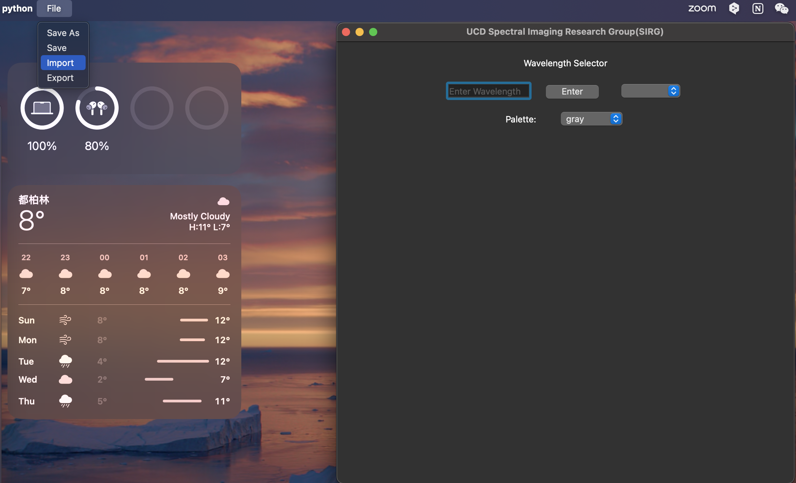
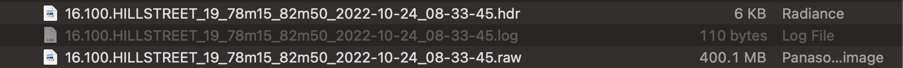
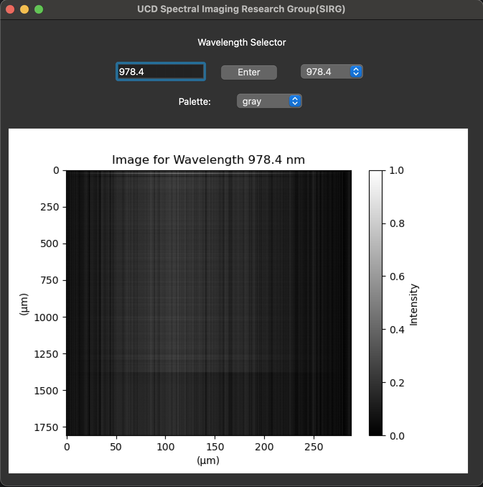
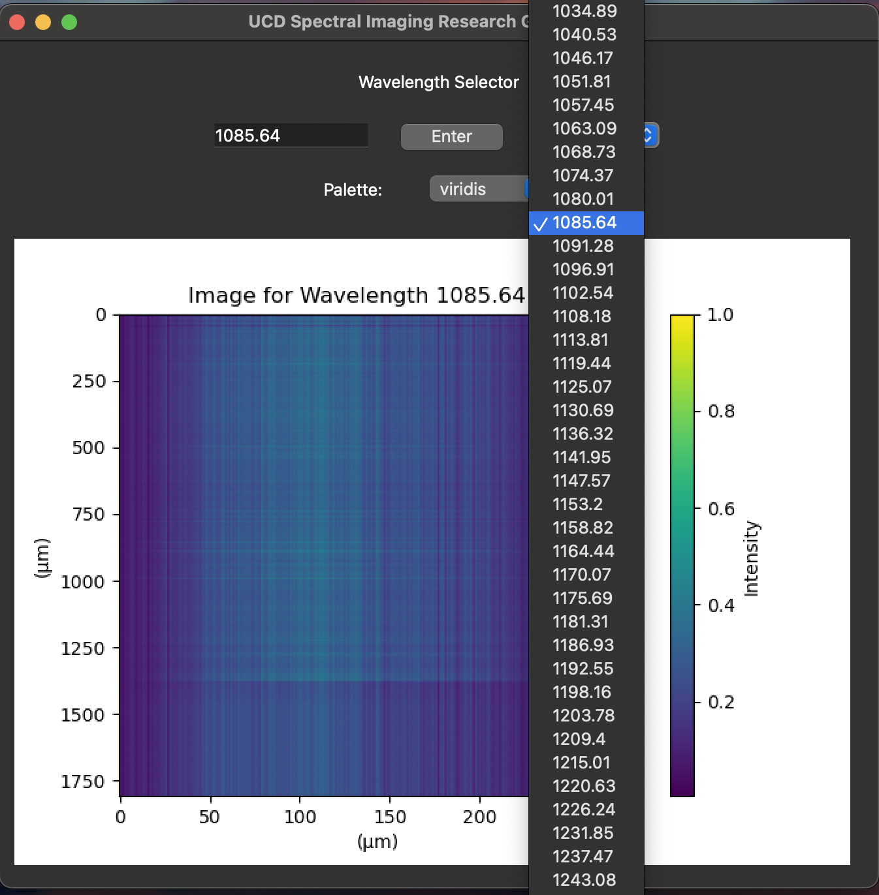
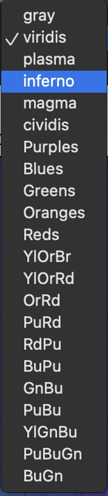
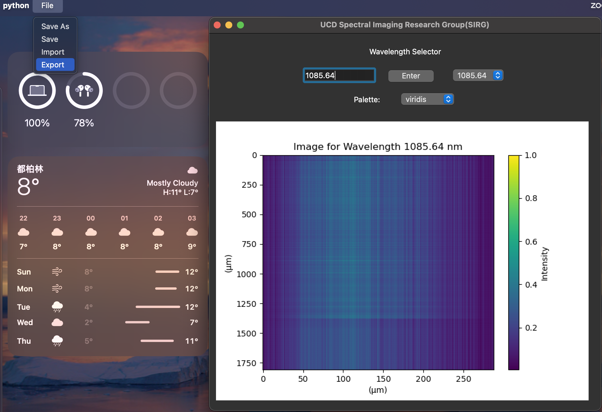
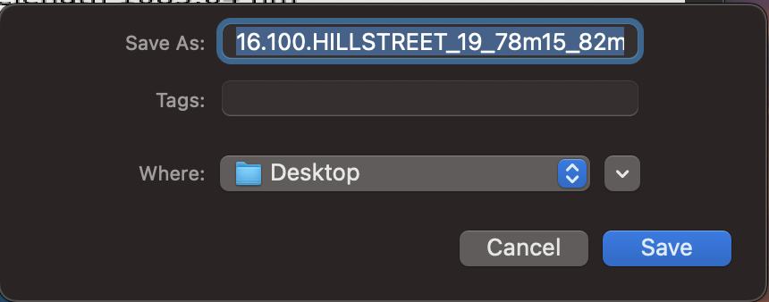
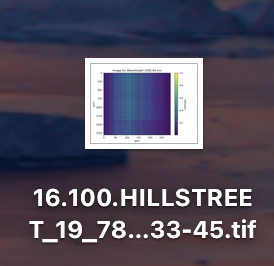
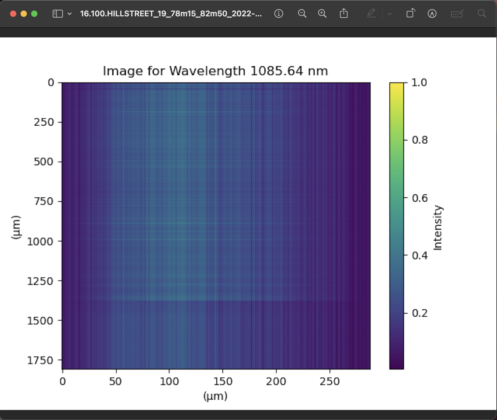

# A GUI for processing Hyperspectral Imaging

## Question:
```
(1) can load hyperspectral imaging data 
(2) show the grayscale image at each selected wavelength.
```

## Solution:
 **Programming Language:** Python
 
 **Framework:** PyQT6
 
 **Packages:** numpy, spectral, matplotlib, pyinstaller
 
 **Resource:** 
 
 1. [Code](https://github.com/rookieeew/SPRG)
 
 2. [Download Application](https://drive.google.com/file/d/1Uu124rfdb9EVxcZoZ148NX5V4PLqRmJY/view?usp=sharing)
 
 3. [Demo Video](https://drive.google.com/file/d/19o3F4WEv1pqw3HkI4rT10IejZUa6jyBp/view?usp=sharing)

## How to use
1. Download Application

     [Download Application](https://drive.google.com/file/d/1Uu124rfdb9EVxcZoZ148NX5V4PLqRmJY/view?usp=sharing)
2. Start this software

     Unzip the zip file and you will get two files. Please double click the file with UCD logo. Wait seconds. 

     
3. Main Window

     The main window is divided into two parts. The upper part is responsible for adjuast the wavelength and the color of image.The lower part is used to show the images.
     
     
4. Import Files
	
     The menu is allocated in the left top of your computer window. Maybe there are some differences between different operating system.(Demo is showing on Mac OSx)

     
    
     You must upload two file after click *Import* button. One file is **.hdr* and another one is **.raw*. There is no need to focus on the order of uploading files. If you just have uploaded one file and close the file dialog window, there is no image to be shown. And you need to re-upload these two required files again. 

     
5. Show Grayscale Image
     After you uploaded two files successfully, you will see the grayscale displaying on the lower part of the main window.(The color of grayscale image is gray, but allow to change the color.)

     
6. Select wavelengths
	   There are two way to change the wavelength of grayscale images. The first way is to type a wavelength in the text line.Only allow to type number and dot.  The maximum of typed number is 12 bits. After you finished typing, you can press *Enter* button or *Enter* on your keyboard. And the second  way changes the wavelength via the combobox allocated on the right side of *Enter* button.
	
     
7. Select different colors via palette Combobox

     Additional funtion. In order to serve colorblind users, they can choose different colors through the color combobox.(I can not make sure these colors suitale for colorblind users. But this problem is easy to deal with.)
	
     
8. Export Grayscale Image as TIFF file
	 
     Addition funtion. If users want to save a grayscale image, they can find *Export* button in the *File* menu that is on the left top.

     The exported image is stored in the same path of original data and with same prefix file name in default. The format of exported file is TIFF. Files in this format are often used for spectral processing, which is of higher quality.

     
  	 
     Users can choose a path as they want to save.

     
  	 
     
  	 
     

## Finished
- [x] Load *.hrd* and *.raw* file
- [x] Display grayscale images
- [x] Choose wavelengths
- [x] Change the color of grayscale images
- [x] Export a specific grayscale

## Todo List
- [ ] Optimize UI design
- [ ] Store and display the uploaded files
- [ ] Display the line plot to show wavelengths and amplitude
- [ ] Add a funtion to compare the grayscale images with various wavelengths
- [ ] If it is possible, integrate with AI and other modern technologies


