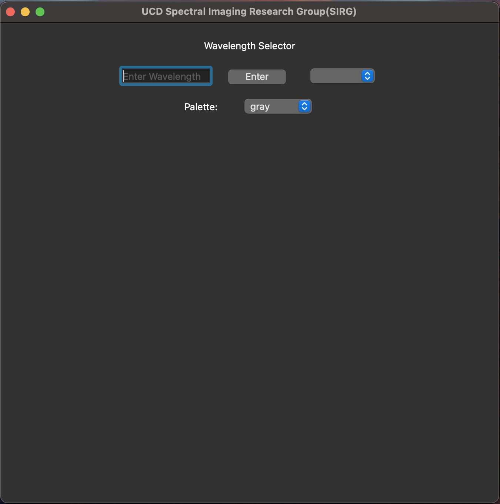

# A GUI for processing Hyperspectral Imaging

## Question:
```
(1) can load hyperspectral imaging data 
(2) show the grayscale image at each selected wavelength.
```

## Solution:
 **Programming Language:** Python
 
 **Framework:** PyQT6
 
 **Packages:** numpy, spectral, matplotlib, pyinstaller
 
 **Resource:** 
 
 1. [Code](https://github.com/rookieeew/SPRG)
 
 2. [Download Application](https://drive.google.com/file/d/1Uu124rfdb9EVxcZoZ148NX5V4PLqRmJY/view?usp=sharing)
 
 3. [Demo Video](https://drive.google.com/file/d/19o3F4WEv1pqw3HkI4rT10IejZUa6jyBp/view?usp=sharing)

## How to use
1. Download Application

     [Download Application](https://drive.google.com/file/d/1Uu124rfdb9EVxcZoZ148NX5V4PLqRmJY/view?usp=sharing)
2. Start this software

     Unzip the zip file and you will get two files. Please double click the file with UCD logo. Wait seconds. 

     
3. Main Window

     The main window is divided into two sections. The upper portion allows adjustment of wavelength and image color, while the lower section displays the images.
     
     
4. Import Files
	
     The menu is allocated in the left top of your computer window. Maybe there are some differences between different operating system.(Demo is showing on Mac OSx)

     
    
     To import files, click on the *Import* button located in the top-left corner of the window. You'll need to upload two files: a *.hdr* file and a *.raw* file. There's no specific order for uploading these files. If only one file is uploaded or the file dialog window is closed without completing the upload, the grayscale images won't be displayed, necessitating a re-upload of both files.

     
5. Show Grayscale Image

  	Upon successful upload of both files, the grayscale image will be displayed in the lower section of the main window. The grayscale image is initially shown in gray, but users can customize the color.

     
8. Select wavelengths

   There are two methods to adjust the wavelength of the grayscale images. Users can either input a wavelength directly into the text field, limited to numbers and decimal points, with a maximum of 12 bits. Upon completion, pressing 'Enter' on the keyboard or clicking the *Enter* button will update the image. Alternatively, users can select a wavelength from the combobox on the right side of the *Enter* button.
	
     
10. Select different colors via palette Combobox

     For added accessibility, users can choose different colors through the color combobox. This feature is particularly useful for colorblind users, allowing them to select a color scheme that suits their needs.(I can not make sure these colors suitale for colorblind users. But this problem is easy to deal with.)
	
     
11. Export Grayscale Image as TIFF file
	 
     Addition funtion. If users want to save a grayscale image, they can find *Export* button in the *File* menu that is on the left top.

     The exported image is stored in the same path of original data and with same prefix file name in default. The format of exported file is *TIFF*. Files in this format are often used for spectral processing, which is of higher quality.

     
  	 
     Users can choose a path as they want to save.

     
  	 
     
  	 
     

## Finished
- [x] Load *.hrd* and *.raw* file
- [x] Display grayscale images
- [x] Choose wavelengths
- [x] Change the color of grayscale images
- [x] Export a specific grayscale

## Todo List
- [ ] Optimize UI design
- [ ] Store and display the uploaded files
- [ ] Display the line plot to show wavelengths and amplitude
- [ ] Add a funtion to compare the grayscale images with various wavelengths
- [ ] If it is possible, integrate with AI and other modern technologies


